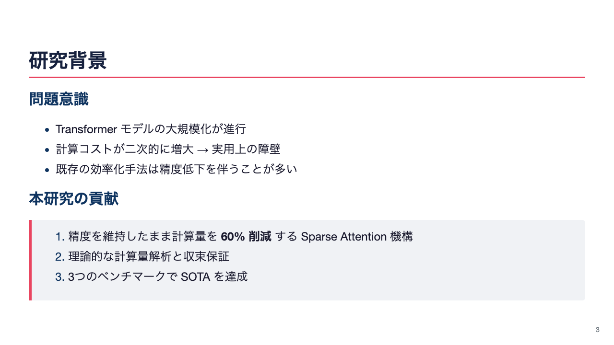
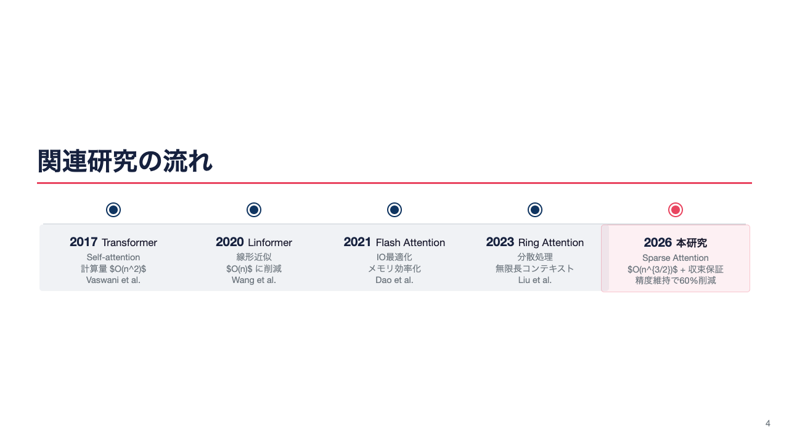
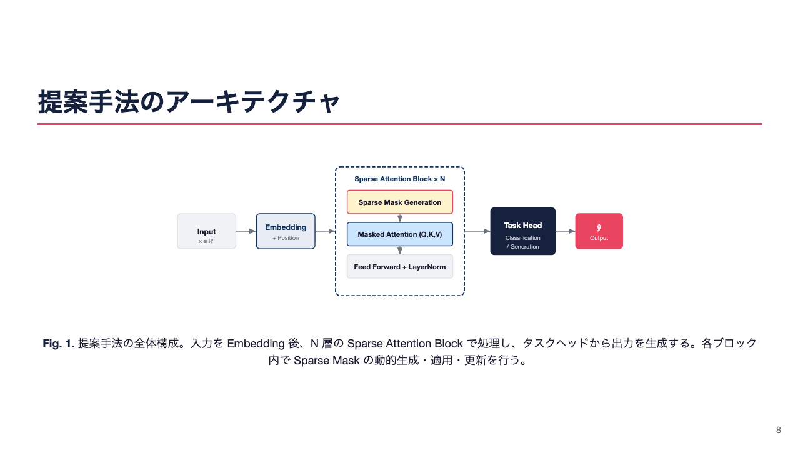
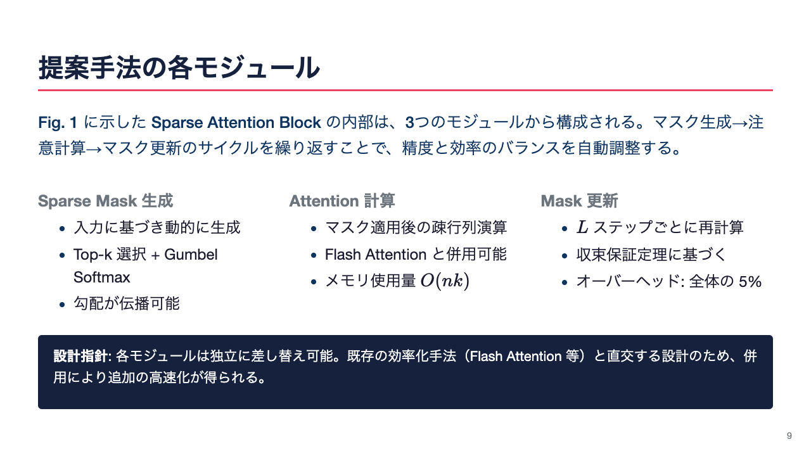
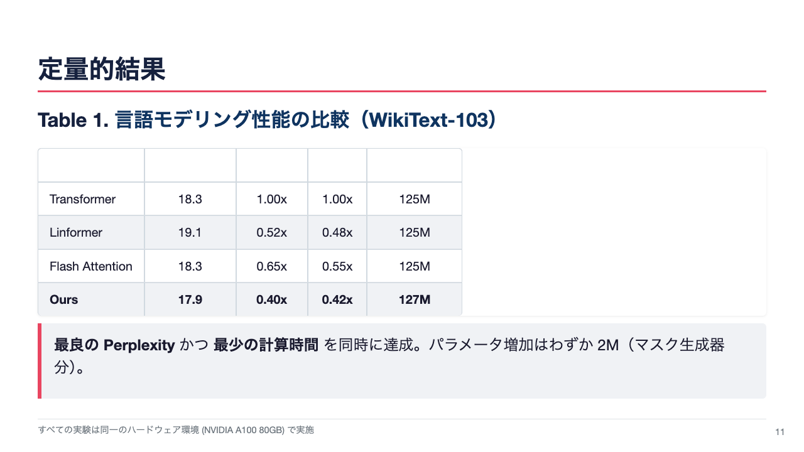
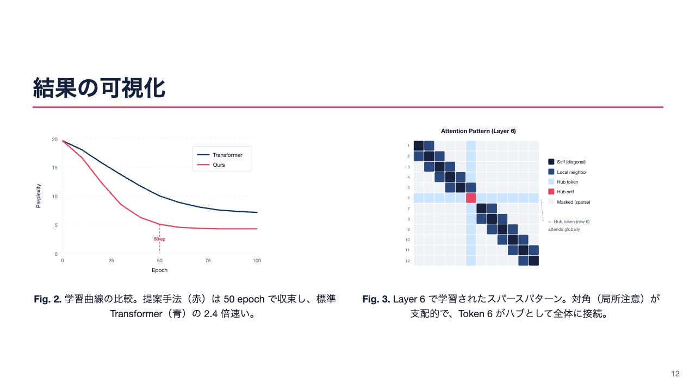
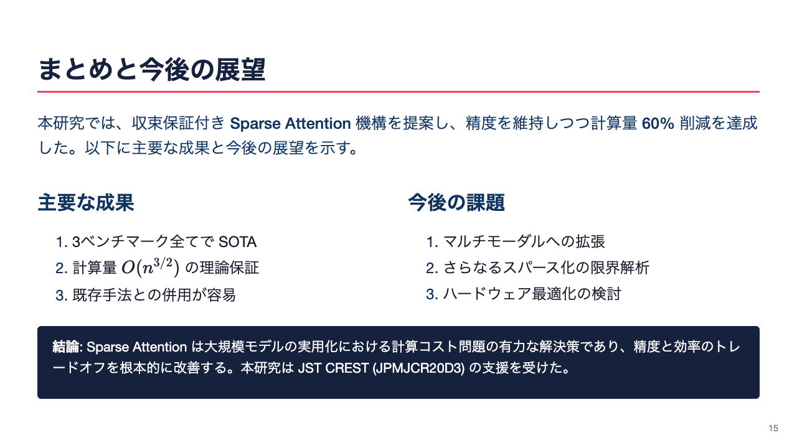

# Marp Academic Slide Templates

学会発表用の Marp スライドテンプレート集。

## Quick Start

```bash
# プレビュー
npx @marp-team/marp-cli --theme themes/academic.css --allow-local-files -p example.md

# PDF出力
npx @marp-team/marp-cli --theme themes/academic.css --pdf --allow-local-files example.md

# PPTX出力
npx @marp-team/marp-cli --theme themes/academic.css --pptx --allow-local-files example.md
```

## Structure

```
themes/academic.css    ← スライドマスター（テーマCSS）
templates/             ← スライド種類別テンプレート（個別ファイル）
assets/                ← SVG図（architecture, learning-curve, sparsity-pattern）
example.md             ← 全テンプレートを使ったサンプル発表
```

## Slide Classes

| Class | Description |
|-------|-------------|
| `title` | タイトルスライド |
| `divider` | セクション区切り |
| `cols-2` / `cols-2-wide-l` / `cols-2-wide-r` | 2カラム |
| `cols-3` | 3カラム |
| `sandwich` | 上下全幅（`.lead` + `.conclusion`）+ 中央マルチカラム |
| `equation` | 数式を大きく中央配置 + 変数説明グリッド |
| `figure` | 図 + LaTeX式キャプション（`Fig. N.`） |
| `table-slide` | 表スタイリング（`Table N.`） |
| `references` | 参考文献リスト |
| `timeline` / `timeline-h` | 歴史フロー（縦/横、ブロック型） |
| `end` | 終了スライド |

## Utility Classes

| Class | Description |
|-------|-------------|
| `.box` | グレー背景ボックス |
| `.box-accent` | 太い左ボーダー赤のボックス |
| `.box-primary` | 太い左ボーダー青のボックス |
| `.lead` | リード文（サンドイッチ上部） |
| `.conclusion` | 結論ボックス（ネイビー背景白文字） |
| `.eq-highlight` / `.eq-highlight-b` | 下線ハイライト（赤/青） |
| `.fig-num` / `.tab-num` | 図番号・表番号（太字） |
| `.footnote` | スライド下部の脚注 |
| `.small` `.muted` `.bold` `.center` | テキストユーティリティ |

## Preview

### Title


### Content + Box


### Horizontal Timeline (Block)


### Equation (Large)


### Equation (Underbrace)


### Figure (SVG)


### Sandwich (Lead + 3-col + Conclusion)


### Table


### 2-Column with Figures


### Summary (Lead + Conclusion)


### References


### End

