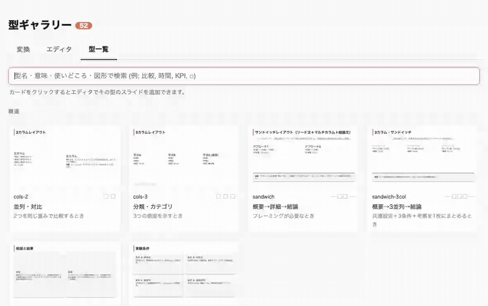
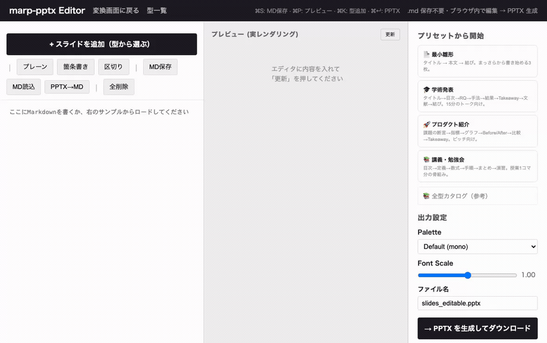

# marp-pptx

Marp Markdown を **編集可能な PowerPoint (.pptx)** に変換する Python ツール。
52 種のセマンティックなスライド型・OMML 数式（PowerPoint でそのまま編集可）・
洗練ミニマルなデザインを、`pip install` 一発で。

> v0.2 で全面リニューアル: 上下中央バランス配置・細いアクセント線・small-caps ラベルに刷新。
> 新デフォルトは `claude`（Anthropic ブランド: 温かいクリーム地＋クレイ accent）。
> 白基調が好みなら `minimal`。タイトル/区切り/数式/カード/表を作り直しました。

## Quick Start

```bash
pip install -e .

# 変換（無指定で claude テーマ = Anthropic cream + clay）
marp-pptx convert deck.md -o deck.pptx

# 白基調の minimal / その他パレット
marp-pptx convert deck.md -p minimal
marp-pptx convert deck.md -p navy

# LibreOffice / Keynote で開く想定なら数式を画像で焼き込む
marp-pptx convert deck.md --math png

# テーマ／型の一覧
marp-pptx themes
marp-pptx types

# ブラウザ編集 UI（要 marp-pptx[web]）
marp-pptx serve
```

## Web UI（ブラウザで作る）

`pip install -e ".[web]"` のうえで `marp-pptx serve` → ブラウザで **http://127.0.0.1:8080**。
Markdown を覚えなくても、**型を選んでフォームに入力するだけ**でスライドが組めます。

### 1. 型ギャラリーから選ぶ — `/types-page`



- 52 種の型を**サムネ付き**で一覧。検索ボックスで「比較」「KPI」「□」などから絞り込み
- カードをクリックすると、その型のフォームを開いた状態で**エディタが起動**

### 2. プリセットから作って即プレビュー — `/editor`



1. 右の「**プリセットから開始**」で雛形を選ぶ（最小雛形 / 学術発表 / プロダクト紹介 / 講義・勉強会）
2. 「**＋スライドを追加**」で型を選び、フォームに入力 → Markdown が自動生成される
3. 「**更新**」で各スライドを実レンダリング（LibreOffice、数秒）。数式は互換性のため画像表示
4. 「**→ PPTX を生成してダウンロード**」で**完全編集可能**な `.pptx` を取得

その他の機能: 画像のドラッグ&ドロップ埋め込み・MD の保存／読込＆オートセーブ・既存 PPTX の読み込み（PPTX→MD）・パレット切替・フォント倍率。

> 型ギャラリーのサムネは `marp-pptx render-gallery` で再生成できます。

## Preview

| | |
|---|---|
|  |  |
|  |  |
|  |  |

## 入力フォーマット

Marp Markdown。スライドは `---` 区切り、型は HTML コメントで指定します。

```markdown
---
marp: true
---

<!-- _class: title -->
# 研究タイトル
## サブタイトルがキッカーになる
山田太郎 / 福井大学 / 2026

---

# 本文スライド
<!-- note: ここは発表者ノート。PPTX のノート欄に入る -->
- 内容は本文領域の上下中央にバランス配置される
- **太字** / `コード` / $x^2$ のインライン記法に対応
```

各型ごとの HTML 構造（`kpi` / `zone-flow` / `equation` など）は
`marp-pptx types` と各テンプレート（`src/marp_pptx/data/templates/`）、[USAGE.md](USAGE.md) を参照。

## デザイン

- **テーマ**: `claude`（デフォルト, Anthropic cream `#faf9f5` + clay `#d97757`）/ `minimal`（白基調）/ `academic` 系 10 パレット
- **配色 (claude)**: ink `#141413` / accent `#d97757` / hairline `#e8e6dc` / cards `#ffffff` on cream
- **数式**: OMML（PowerPoint で編集可能, デフォルト）/ matplotlib PNG（`--math png`）
- **編集可能性**: すべて実テキストボックス + 実テーブル + OMML。一枚絵の画像化はしない

## AI から使う

### Claude スキル
`skills/marp-pptx/` は Claude にデッキの作り方（型選択フロー・正確な HTML 骨組み・落とし穴）を教える
[Claude Code スキル](skills/README.md)。どのプロジェクトからでも使えるよう導入:

```bash
ln -s "$(pwd)/skills/marp-pptx" ~/.claude/skills/marp-pptx
```

### MCP サーバー
`marp-pptx[mcp]` でエージェントが会話から**編集可能 PPTX を生成し、画像で自己確認**できる。

```bash
pip install -e ".[mcp]"
```

MCP クライアント設定（例: Claude Desktop / Claude Code）:

```json
{ "mcpServers": { "marp-pptx": { "command": "marp-pptx-mcp" } } }
```

公開ツール: `slide_types`（52型カタログ）/ `slide_template`（型の骨組み）/ `list_presets`・`get_preset` /
`build_pptx`（MD→編集可能.pptx ＋ lint）/ **`preview_png`**（各スライドを画像で返す＝AI が下書きを見て直せる）。

## ドキュメント

- 全機能・全 52 型の詳細は [USAGE.md](USAGE.md)
- 今後の計画は [ROADMAP.md](ROADMAP.md)
