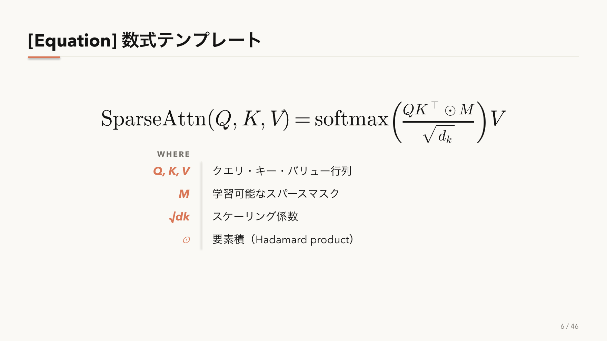
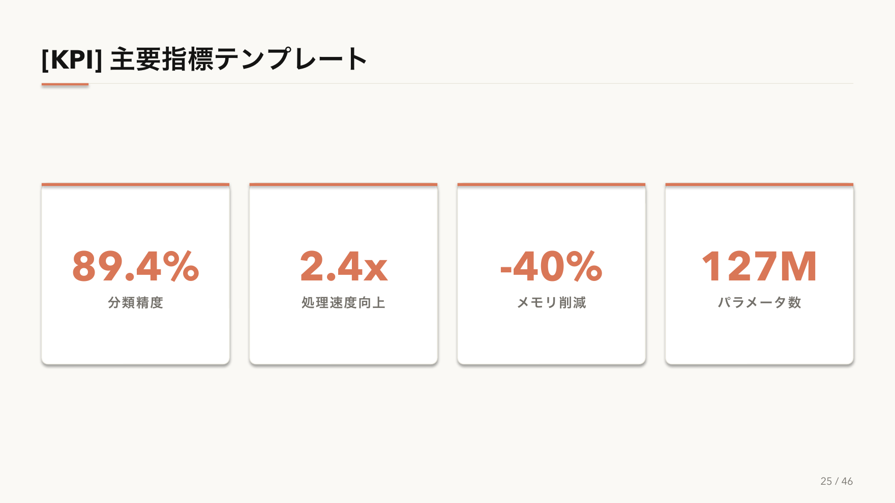
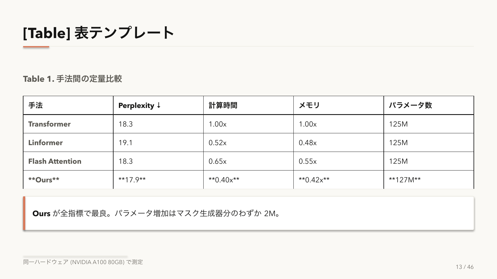
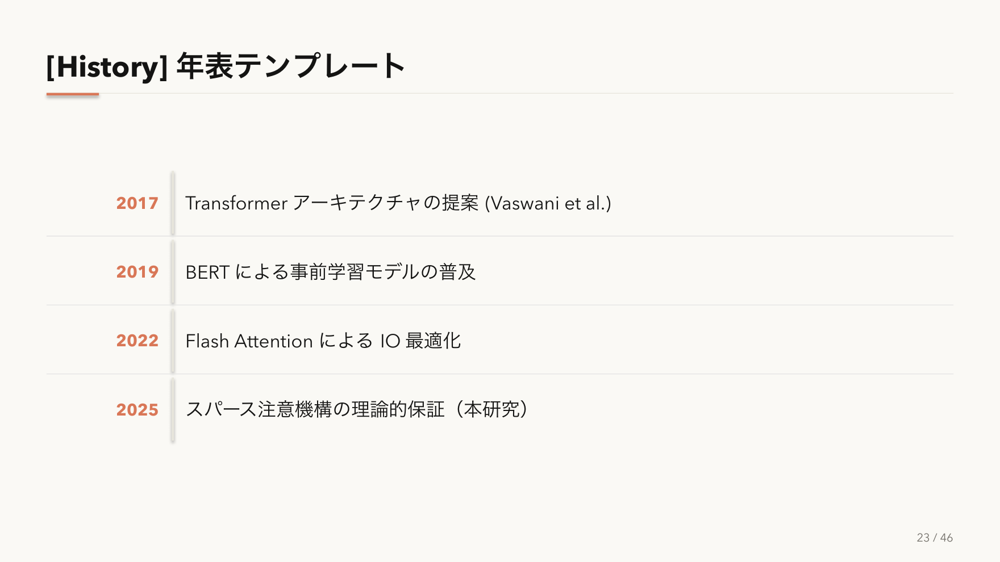

# marp-pptx

Marp Markdown を **編集可能な PowerPoint (.pptx)** に変換する Python ツール。
49 種のセマンティックなスライド型・OMML 数式（PowerPoint でそのまま編集可）・
洗練ミニマルなデザインを、`pip install` 一発で。

> v0.2 で全面リニューアル: 上下中央バランス配置・細いアクセント線・small-caps ラベルに刷新。
> 新デフォルトは `claude`（Anthropic ブランド: 温かいクリーム地＋クレイ accent）。
> 白基調が好みなら `minimal`。タイトル/区切り/数式/カード/表を作り直しました。

## Quick Start

```bash
pip install -e .

# 変換（無指定で claude テーマ = Anthropic cream + clay）
marp-pptx convert deck.md -o deck.pptx

# 白基調の minimal / その他パレット
marp-pptx convert deck.md -p minimal
marp-pptx convert deck.md -p navy

# LibreOffice / Keynote で開く想定なら数式を画像で焼き込む
marp-pptx convert deck.md --math png

# テーマ／型の一覧
marp-pptx themes
marp-pptx types

# ブラウザ編集 UI（要 marp-pptx[web]）
marp-pptx serve
```

## Preview

| | |
|---|---|
|  |  |
|  |  |
|  |  |

## 入力フォーマット

Marp Markdown。スライドは `---` 区切り、型は HTML コメントで指定します。

```markdown
---
marp: true
---

<!-- _class: title -->
# 研究タイトル
## サブタイトルがキッカーになる
山田太郎 / 福井大学 / 2026

---

# 本文スライド
<!-- note: ここは発表者ノート。PPTX のノート欄に入る -->
- 内容は本文領域の上下中央にバランス配置される
- **太字** / `コード` / $x^2$ のインライン記法に対応
```

各型ごとの HTML 構造（`kpi` / `zone-flow` / `equation` など）は
`marp-pptx types` と各テンプレート（`src/marp_pptx/data/templates/`）、[USAGE.md](USAGE.md) を参照。

## デザイン

- **テーマ**: `claude`（デフォルト, Anthropic cream `#faf9f5` + clay `#d97757`）/ `minimal`（白基調）/ `academic` 系 10 パレット
- **配色 (claude)**: ink `#141413` / accent `#d97757` / hairline `#e8e6dc` / cards `#ffffff` on cream
- **数式**: OMML（PowerPoint で編集可能, デフォルト）/ matplotlib PNG（`--math png`）
- **編集可能性**: すべて実テキストボックス + 実テーブル + OMML。一枚絵の画像化はしない

## ドキュメント

- 全機能・全 49 型の詳細は [USAGE.md](USAGE.md)
- 今後の計画は [ROADMAP.md](ROADMAP.md)
