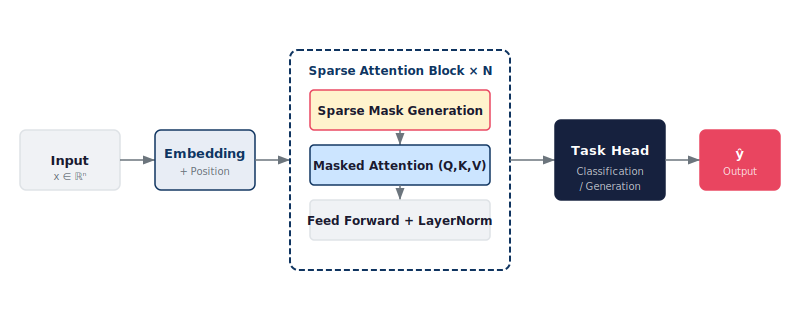
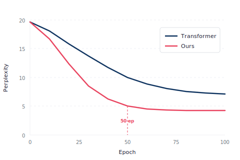
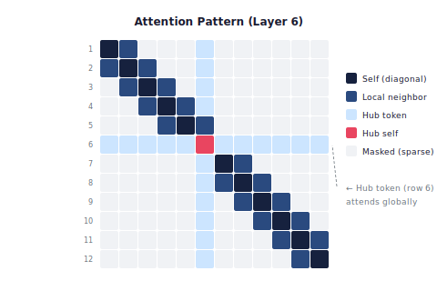

<!-- _class: title -->
<!-- _paginate: false -->

# 効率的な Transformer 拡張手法の提案
## — Sparse Attention による計算量削減 —

山田 太郎 $^{1}$, 佐藤 花子 $^{2}$

$^{1}$ XX大学 工学研究科 &emsp; $^{2}$ YY研究所

Conference on Machine Learning 2026 &ensp;|&ensp; 2026年 9月 15日

---

<!-- _class: divider -->
<!-- _paginate: false -->

# 1. 背景と動機

## 大規模モデルの計算コスト問題

---

# 研究背景

## 問題意識

- Transformer モデルの大規模化が進行
- 計算コストが二次的に増大 → 実用上の障壁
- 既存の効率化手法は精度低下を伴うことが多い

## 本研究の貢献

1. 精度を維持したまま計算量を **60% 削減** する Sparse Attention 機構
2. 理論的な計算量解析と収束保証
3. 3つのベンチマークで SOTA を達成

---

<!-- _class: timeline-h -->

# 関連研究の流れ

  

    2017
    Transformer
    
Self-attention 計算量 $O(n^2)$ Vaswani et al.

  

  

    2020
    Linformer
    
線形近似 $O(n)$ に削減 Wang et al.

  

  

    2021
    Flash Attention
    
IO最適化 メモリ効率化 Dao et al.

  

  

    2023
    Ring Attention
    
分散処理 無限長コンテキスト Liu et al.

  

  

    2026
    本研究
    
Sparse Attention $O(n^{3/2})$ + 収束保証 精度維持で60%削減

  

---

<!-- _class: divider -->
<!-- _paginate: false -->

# 2. 提案手法

## Sparse Attention with Convergence Guarantee

---

<!-- _class: equation -->

# コア数式

$$\text{SparseAttn}(Q,K,V) = \text{softmax}\!\left(\frac{QK^\top \odot M}{\sqrt{d_k}}\right)V$$

  $Q, K, V$
  クエリ・キー・バリュー行列
  $M$
  学習可能なスパースマスク（$M_{ij} \in \{0, 1\}$）
  $\sqrt{d_k}$
  スケーリング係数
  $\odot$
  要素積（Hadamard product）

---

<!-- _class: equation -->

# 計算量解析

$$T(n) = \underbrace{O(n \cdot k)}_{\text{スパース注意}} + \underbrace{O(n \log n)}_{\text{マスク更新}} \ll \underbrace{O(n^2)}_{\text{標準 Attention}}$$

  $n$
  系列長
  $k$
  各トークンが参照する近傍数（$k \ll n$）
  $T(n)$
  1層あたりの計算時間

$k = O(\sqrt{n})$ と設定することで $T(n) = O(n^{3/2})$ を達成

---

<!-- _class: figure -->

# 提案手法のアーキテクチャ

Fig. 1. 提案手法の全体構成。入力を Embedding 後、N 層の Sparse Attention Block で処理し、タスクヘッドから出力を生成する。各ブロック内で Sparse Mask の動的生成・適用・更新を行う。

---

<!-- _class: sandwich -->

# 提案手法の各モジュール

Fig. 1 に示した Sparse Attention Block の内部は、3つのモジュールから構成される。マスク生成→注意計算→マスク更新のサイクルを繰り返すことで、精度と効率のバランスを自動調整する。

### Sparse Mask 生成

- 入力に基づき動的に生成
- Top-k 選択 + Gumbel Softmax
- 勾配が伝播可能

### Attention 計算

- マスク適用後の疎行列演算
- Flash Attention と併用可能
- メモリ使用量 $O(nk)$

### Mask 更新

- $L$ ステップごとに再計算
- 収束保証定理に基づく
- オーバーヘッド: 全体の 5%

**設計指針**: 各モジュールは独立に差し替え可能。既存の効率化手法（Flash Attention 等）と直交する設計のため、併用により追加の高速化が得られる。

---

<!-- _class: divider -->
<!-- _paginate: false -->

# 3. 実験と結果

## 3つのベンチマークでの評価

---

<!-- _class: table-slide -->

# 定量的結果

## Table 1. 言語モデリング性能の比較（WikiText-103）

| 手法 | Perplexity ↓ | 計算時間 | メモリ | パラメータ数 |
|------|:-----------:|:------:|:----:|:---------:|
| Transformer | 18.3 | 1.00x | 1.00x | 125M |
| Linformer | 19.1 | 0.52x | 0.48x | 125M |
| Flash Attention | 18.3 | 0.65x | 0.55x | 125M |
| **Ours** | **17.9** | **0.40x** | **0.42x** | **127M** |

**最良の Perplexity** かつ **最少の計算時間** を同時に達成。パラメータ増加はわずか 2M（マスク生成器分）。

すべての実験は同一のハードウェア環境 (NVIDIA A100 80GB) で実施

---

<!-- _class: cols-2 -->

# 結果の可視化

Fig. 2. 学習曲線の比較。提案手法（赤）は 50 epoch で収束し、標準 Transformer（青）の 2.4 倍速い。

Fig. 3. Layer 6 で学習されたスパースパターン。対角（局所注意）が支配的で、Token 6 がハブとして全体に接続。

---

<!-- _class: cols-3 -->

# ベンチマーク別結果

### WikiText-103

- PPL: **17.9**
- 計算: 0.40x
- 改善: -2.2%

### GLUE (avg)

- Score: **89.4**
- 計算: 0.38x
- 改善: +1.1%

### Long Range Arena

- Acc: **82.1**
- 計算: 0.35x
- 改善: +3.6%

Long Range Arena では長系列タスクが多いため、スパース化の恩恵が最大

---

<!-- _class: divider -->
<!-- _paginate: false -->

# 4. まとめ

---

<!-- _class: sandwich -->

# まとめと今後の展望

本研究では、収束保証付き Sparse Attention 機構を提案し、精度を維持しつつ計算量 60% 削減を達成した。以下に主要な成果と今後の展望を示す。

## 主要な成果

1. 3ベンチマーク全てで SOTA
2. 計算量 $O(n^{3/2})$ の理論保証
3. 既存手法との併用が容易

## 今後の課題

1. マルチモーダルへの拡張
2. さらなるスパース化の限界解析
3. ハードウェア最適化の検討

**結論**: Sparse Attention は大規模モデルの実用化における計算コスト問題の有力な解決策であり、精度と効率のトレードオフを根本的に改善する。本研究は JST CREST (JPMJCR20D3) の支援を受けた。

---

<!-- _class: references -->
<!-- _paginate: false -->

# References

<ol>
<li>
  Vaswani, A. et al.
  "Attention Is All You Need."
  NeurIPS, 2017.
</li>
<li>
  Wang, S. et al.
  "Linformer: Self-Attention with Linear Complexity."
  arXiv:2006.04768, 2020.
</li>
<li>
  Dao, T. et al.
  "FlashAttention: Fast and Memory-Efficient Exact Attention with IO-Awareness."
  NeurIPS, 2022.
</li>
<li>
  Liu, H. et al.
  "Ring Attention with Blockwise Transformers for Near-Infinite Context."
  ICLR, 2024.
</li>
<li>
  Devlin, J. et al.
  "BERT: Pre-training of Deep Bidirectional Transformers."
  NAACL-HLT, 2019.
</li>
</ol>

---

<!-- _class: end -->
<!-- _paginate: false -->

# Thank you

Questions?

taro.yamada@xx-university.ac.jp
