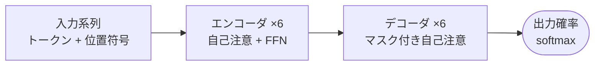

<!-- _class: title -->
# 文献報告：Attention Is All You Need
## 輪読会 第12回
発表者名 / 2026-XX-XX

---

<!-- _class: paper -->

# Attention Is All You Need

## 文献報告｜再帰を捨てた自己注意のみの系列変換

  Vaswani, A., Shazeer, N., Parmar, N. et al.（Google Brain / Google Research）
  NeurIPS 2017
  被引用 130,000+ ／ arXiv:1706.03762

  選定理由
  自研究の注意機構スパース化の出発点。計算量 $O(n^2)$ がどの設計判断から生じたかを原典で確認する。

- 再帰・畳み込みを排し **Multi-Head Self-Attention** のみで系列変換を構成
- WMT14 EN-DE で BLEU ==28.4==（当時 SOTA）、学習コストは従来比 1/4

---

<!-- _class: sections -->

# 論文の 3 つの主張

  主張 1｜注意機構だけで系列変換は完結する
  エンコーダ・デコーダとも自己注意＋位置別 FFN の積層のみ。系列長 $n$ に対し経路長 $O(1)$ で長距離依存を扱える。

  主張 2｜Multi-Head が表現部分空間を並列化する
  $h=8$ 個のヘッドが異なる位置関係を同時に学習。単一ヘッドの平均化による情報損失を回避する。

  主張 3｜再帰の除去が学習の並列化を解放する
  系列方向の逐次依存が消え、GPU 上で全時刻を同時計算。学習時間はベースライン比 ==1/4 以下==。

---

<!-- _class: flow -->

# 手法の全体像

## アーキテクチャ｜注意＋FFN の積層が系列を変換する

---

<!-- _class: equation -->
# 中核の数式

$$\mathrm{Attention}(Q, K, V) = \mathrm{softmax}\!\left(\frac{QK^\top}{\sqrt{d_k}}\right)V$$

$Q, K, V$クエリ・キー・バリュー行列
$\sqrt{d_k}$スケーリング係数（勾配消失を防止）
$QK^\top$類似度スコア — 計算量 $O(n^2)$ の源泉

---

<!-- _class: table-slide -->
# 関連研究との比較

各手法の性質比較（○=満たす／△=部分的／×=満たさない）

| 手法 | 並列学習 | 長距離 | 計算量 | 解釈性 |
|---|---|---|---|---|
| RNN (LSTM) | × | △ | ○ | △ |
| CNN (ConvS2S) | ○ | △ | ○ | × |
| **Transformer（本論文）** | ○ | ○ | × | ○ |

位置づけ: 並列性と長距離依存を同時に解決した初の構成。計算量 $O(n^2)$ だけが残された弱点で、後続研究（本研究含む）の出発点になる。

---

<!-- _class: pros-cons -->
# 強みと限界

<li>学習の完全並列化で大規模化に道を開いた</li>
<li>経路長 $O(1)$ で長距離依存を直接扱える</li>
<li>注意重みの可視化で解釈性が高い</li>

<li>計算量・メモリが系列長の 2 乗 $O(n^2)$</li>
<li>位置符号は外挿に弱く長系列で劣化</li>
<li>小データでは RNN に劣る場合がある</li>

---

<!-- _class: takeaway -->
# 自研究への示唆
## $O(n^2)$ の源泉は $QK^\top$ の全ペア計算 — ここをスパース化すれば主張 1〜3 は保存できる
- 主張 1（経路長 $O(1)$）はスパース化後も局所+大域パターンで維持可能
- 評価は WMT14 と同条件で比較し、BLEU 低下 1pt 以内を目標とする
- 位置符号の外挿弱性は本研究のスコープ外（関連: ALiBi, RoPE）

---

<!-- _class: references -->
# 参考文献
<ol>
<li>
  Vaswani, A. et al.
  "Attention Is All You Need."
  NeurIPS, 2017.
</li>
<li>
  Gehring, J. et al.
  "Convolutional Sequence to Sequence Learning."
  ICML, 2017.
</li>
<li>
  Child, R. et al.
  "Generating Long Sequences with Sparse Transformers."
  arXiv:1904.10509, 2019.
</li>
</ol>

---

<!-- _class: end -->
# ご清聴ありがとうございました
質問・議論歓迎
